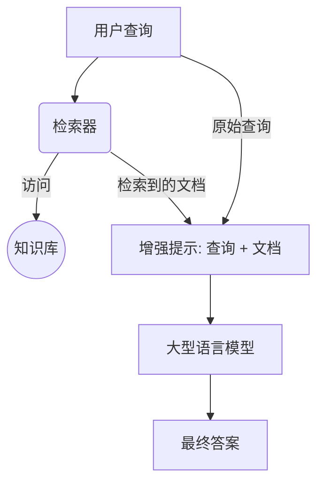

## 前言

近年来，人工智能领域取得了令人瞩目的进展，其中大型语言模型（LLM）、检索增强生成（RAG）和智能体（Agent）是三个备受关注的核心概念。它们不仅各自展现出强大的能力，而且相互关联，共同推动着AI技术向更智能、更实用的方向发展。本文将详细介绍这三个概念，并探讨它们之间的紧密联系。

## 大型语言模型 (LLM)

### 定义和基本概念

大型语言模型（Large Language Model, LLM）是一种基于深度学习的自然语言处理模型，其特点是拥有海量的参数（通常达到数十亿甚至数万亿级别）并在大规模文本数据上进行训练。LLM的核心目标是理解和生成人类语言。

### 主要能力

LLM展现出多种令人印象深刻的能力，主要包括：

*   **文本生成**：能够根据输入的提示（prompt）生成连贯、相关的文本内容，例如撰写文章、邮件、诗歌、代码等。
*   **语义理解**：能够理解文本的含义，包括识别实体、关系、情感、意图等。
*   **问答**：能够回答用户提出的各种问题，包括事实性问题、推理问题等。
*   **翻译**：能够将文本从一种语言翻译成另一种语言。
*   **文本摘要**：能够将长文本的核心内容概括成简短的摘要。
*   **对话**：能够与用户进行多轮对话，保持上下文连贯性。

### 常见的例子

*   **GPT系列 (Generative Pre-trained Transformer)**：由OpenAI开发，是目前最知名的LLM系列之一，例如GPT-3, GPT-3.5, GPT-4。
*   **BERT (Bidirectional Encoder Representations from Transformers)**：由Google开发，是一种基于Transformer的预训练模型，主要用于理解任务。
*   **LLaMA (Large Language Model Meta AI)**：由Meta AI发布，是一个开源的大型语言模型系列。
*   **Claude系列**：由Anthropic开发，注重AI的安全性和可控性。

### 局限性

尽管LLM能力强大，但也存在一些固有的局限性：

*   **知识截止 (Knowledge Cutoff)**：LLM的知识来源于其训练数据，训练完成后，模型内部的知识就不会再更新。因此，它们通常不了解训练数据截止日期之后发生的事件或信息。
*   **幻觉 (Hallucination)**：LLM有时会生成看似合理但实际上是虚假或不准确的信息，这种现象被称为“幻觉”。
*   **缺乏真实世界的 grounding**：LLM主要通过文本学习，缺乏与物理世界的直接交互和理解。
*   **计算资源消耗大**：训练和部署大型LLM需要巨大的计算资源和能源。
*   **偏见和安全性问题**：训练数据中可能存在的偏见会被LLM学习并放大，同时也可能生成有害或不安全的内容。

## 检索增强生成 (RAG)

### 定义和核心思想

检索增强生成（Retrieval Augmented Generation, RAG）是一种将信息检索（Retrieval）与文本生成（Generation）相结合的技术框架。其核心思想是在LLM生成文本之前，先从一个外部知识库中检索相关的最新信息，并将这些信息作为上下文（context）提供给LLM，从而指导LLM生成更准确、更相关、更及时的内容。

### 为什么需要RAG（解决LLM的局限性）

RAG的出现主要是为了解决LLM的一些关键局限性，特别是：

*   **知识截止**：通过引入外部知识库，RAG可以为LLM提供最新的信息，克服其知识截止的问题。
*   **幻觉**：通过提供相关的、基于事实的上下文，RAG可以显著减少LLM产生幻觉的可能性，提高生成内容的可信度。
*   **领域适应性**：对于特定领域的知识，RAG可以通过连接到该领域的专业数据库来增强LLM在该领域的表现，而无需对LLM本身进行重新训练。
*   **可解释性和可追溯性**：RAG检索到的信息可以作为LLM生成内容的依据，使得生成结果更具可解释性，并且可以追溯到信息来源。

### RAG的工作流程

RAG 工作流程示意图:


RAG系统通常包含以下三个主要步骤：

1.  **检索 (Retrieve)**：当用户提出一个查询或提示时，RAG系统首先使用一个检索器（Retriever）从外部知识库（例如向量数据库、文本语料库、API等）中查找与查询最相关的信息片段。
2.  **增强 (Augment)**：检索到的信息片段会与用户的原始查询或提示合并，形成一个增强的提示（augmented prompt）。
3.  **生成 (Generate)**：增强的提示被输入到LLM中，LLM基于原始查询和检索到的上下文信息生成最终的回复。

### RAG的优势

*   **提高准确性和事实性**：通过引入外部知识，减少幻觉。
*   **增强知识的时效性**：能够获取最新的信息。
*   **降低训练成本**：无需为获取新知识而频繁重新训练LLM。
*   **提高透明度和可信度**：可以追溯信息来源。
*   **领域专业化**：更容易适应特定领域的知识需求。

## 智能体 (Agent)

### 定义和基本组成

智能体（Agent）是一种能够感知其环境、进行思考和规划，并采取行动以实现特定目标的计算实体。在当前的AI语境下，AI Agent通常以一个强大的LLM作为其核心“大脑”，并辅以其他关键组件：

AI Agent 组件示意图:
```mermaid
graph TD
    LLM[LLM (核心大脑)];

    subgraph "输入"
        direction LR
        Perception[感知 (文本, 图像等)];
    end
    
    subgraph "内部处理模块"
        direction TB
        Planning[规划能力];
        Memory[记忆 (短期/长期)];
        ToolUse[工具使用];
    end

    subgraph "输出"
        direction LR
        Action[行动 (文本, API调用等)];
    end

    Perception --> LLM;
    LLM --> Planning;
    LLM --> Memory;
    LLM --> ToolUse;
    LLM --> Action;

    subgraph "可用工具示例"
      direction TB
      T1[工具1: RAG 系统];
      T2[工具2: 代码解释器];
      T3[工具3: 网页搜索API];
      T_etc[等等...];
    end
    
    ToolUse -.-> T1;
    ToolUse -.-> T2;
    ToolUse -.-> T3;
    ToolUse -.-> T_etc;

    class LLM llmCore;
    class Perception,Action inputOutput;
    class Planning,Memory,ToolUse processingModule;
    class T1,T2,T3,T_etc tool;

    classDef llmCore fill:#ddeeff,stroke:#333,stroke-width:2px,color:#000000;
    classDef inputOutput fill:#eeffdd,stroke:#333,stroke-width:2px,color:#000000;
    classDef processingModule fill:#ffeebb,stroke:#333,stroke-width:2px,color:#000000;
    classDef tool fill:#eee,stroke:#555,stroke-width:1px,color:#000000;
```

*   **LLM (大脑)**：作为Agent的核心，负责理解用户指令、进行常识推理、制定计划、甚至生成行动指令。
*   **工具使用 (Tool Use)**：Agent可以被赋予使用各种外部工具的能力，例如搜索引擎、计算器、代码解释器、API接口等。这使得Agent能够获取LLM本身不具备的信息或执行LLM无法完成的操作。
*   **规划能力 (Planning)**：Agent能够将复杂的目标分解为一系列可执行的子任务，并制定行动计划。这可能涉及到多步推理和决策。
*   **记忆 (Memory)**：Agent可以拥有短期记忆（用于跟踪当前任务的上下文）和长期记忆（用于存储过去的经验和知识，以便在未来任务中复用）。
*   **感知 (Perception)**：虽然目前主要基于文本，但未来的Agent可能会拥有更丰富的感知能力，例如处理图像、音频等多模态信息。

### Agent与LLM的区别

虽然Agent的核心通常是LLM，但两者之间存在关键区别：

| 特征       | 大型语言模型 (LLM)                               | 智能体 (Agent)                                       |
| :--------- | :----------------------------------------------- | :----------------------------------------------------- |
| **主要功能** | 理解和生成文本                                     | 感知、思考、规划并采取行动以实现目标                     |
| **交互方式** | 通常是被动响应用户输入                             | 主动与环境交互，执行任务                               |
| **决策能力** | 有限的决策能力，主要基于模式匹配和概率生成         | 具有更强的决策和规划能力，能够自主选择行动路径           |
| **工具使用** | 本身不直接使用外部工具（除非通过RAG等方式间接实现） | 可以主动调用和使用各种外部工具                         |
| **目标导向** | 目标是生成连贯相关的文本                           | 目标是完成用户指定的复杂任务或实现特定目标               |
| **自主性**   | 较低                                             | 更高，可以在一定程度上自主行动                         |

简单来说，LLM更像是一个强大的语言处理引擎，而Agent则是一个更完整的、具有自主行动能力的系统。

### Agent的工作模式（例如：ReAct框架）

Agent的工作模式多种多样，其中一个有影响力的框架是**ReAct (Reason and Act)**。ReAct框架的核心思想是让LLM通过交错的“思考（Reasoning）”和“行动（Acting）”步骤来完成任务：

1.  **思考 (Reason)**：LLM分析当前任务和已有信息，生成一个对当前情况的理解和下一步行动的计划（例如，我需要查找X信息，我应该使用搜索引擎工具）。
2.  **行动 (Act)**：LLM根据思考结果，决定调用哪个工具以及如何调用（例如，生成调用搜索引擎API的请求，查询关键词X）。
3.  **观察 (Observe)**：Agent执行行动（例如，调用工具）并获取结果（例如，搜索引擎返回的结果）。
4.  **迭代**：Agent将观察到的结果作为新的信息，再次进入思考步骤，评估当前进展，调整计划，并决定下一步的行动。这个循环会一直持续，直到任务完成或达到某个停止条件。

ReAct框架使得Agent能够进行更复杂的推理、使用工具获取外部信息、并根据环境反馈动态调整其行为。

### Agent的应用场景

Agent的潜在应用场景非常广泛，包括：

*   **个人助理**：管理日程、发送邮件、预订服务等。
*   **自动化任务执行**：例如自动化软件测试、数据录入、客户服务等。
*   **复杂问题解决**：例如进行科学研究、市场分析、故障诊断等。
*   **交互式娱乐**：例如在游戏中扮演更智能的NPC（非玩家角色）。
*   **教育和培训**：提供个性化的学习辅导。
*   **机器人控制**：赋予机器人更强的自主导航和操作能力。

## LLM, RAG, Agent之间的关系

LLM、RAG和Agent三者之间存在着密切且层层递进的关系：

*   **LLM是基础**：LLM提供了核心的自然语言理解、生成和一定程度的推理能力。它是RAG和Agent实现其功能不可或缺的基石。没有LLM强大的语言能力，RAG无法有效地将检索到的信息融入生成过程，Agent也无法理解指令、进行规划和与工具交互。

*   **RAG是LLM的一种增强应用模式**：RAG可以看作是LLM在特定应用场景下的一种“插件”或“增强模块”。它通过引入外部知识库，有效地缓解了LLM知识陈旧和容易产生幻觉的问题，使得LLM在需要准确、及时信息的任务中表现更佳。RAG本身并不改变LLM的核心架构，而是优化了LLM获取和利用信息的方式。

*   **Agent是更高级的系统，LLM是其核心，RAG可作为其工具**：Agent代表了更进一步的AI系统形态。它以LLM为“大脑”，但不仅仅局限于语言处理。Agent被赋予了更强的自主性、规划能力和执行能力，可以通过使用各种工具（包括RAG）与外部世界进行交互，以完成复杂的目标。
    *   **LLM for Agent**: Agent利用LLM进行理解、推理、规划和决策。
    *   **RAG for Agent**: RAG可以作为Agent获取外部知识的一种重要工具。当Agent需要回答基于特定文档的问题，或者需要获取LLM训练数据之外的最新信息时，它可以调用RAG系统来检索相关内容，并将这些内容用于后续的思考和行动。

LLM, RAG, Agent 关系示意图:
```mermaid
graph TD
    subgraph Agent [智能体 (Agent)]
        direction TB
        A_Planning[规划与决策模块]
        A_Memory[记忆模块]
        
        subgraph CoreBrain [核心大脑]
            direction TB
            A_LLM[LLM 核心]
            A_RAG[RAG 组件: 检索与增强]
            A_KB((外部知识库))
            
            A_LLM --> A_RAG;
            A_RAG -- 访问 --> A_KB;
        end
        
        A_ToolUse[工具使用模块];

        CoreBrain --> A_Planning;
        A_Planning --> A_Memory;
        A_Planning --> A_ToolUse;
        A_ToolUse --> A_Action[执行动作/输出];
        A_Memory --> CoreBrain;

        subgraph Tools_Examples [工具示例]
            direction LR
            Tool1[代码解释器];
            Tool2[API 调用];
            Tool_etc[其他...];
        end
        A_ToolUse -.-> Tools_Examples;
    end

    subgraph Standalone_RAG [独立的 RAG 系统 (增强LLM)]
        direction TB
        R_LLM_Instance[LLM 实例]
        R_Retriever[检索器]
        R_KB_Instance((外部知识库))
        R_AugPrompt[增强提示模块]

        R_Retriever -- 从 --> R_KB_Instance;
        R_Retriever -- 检索内容 --> R_AugPrompt;
        R_LLM_Instance -- 原始查询 --> R_AugPrompt;
        R_AugPrompt --> R_LLM_Instance;
    end
    
    subgraph Base_LLM [基础 LLM]
        LLM_Only[LLM (语言理解/生成)];
    end

    classDef agent_style fill:#e6f3ff,stroke:#007bff,stroke-width:2px,color:#000;
    classDef rag_style fill:#e6ffe6,stroke:#28a745,stroke-width:2px,color:#000;
    classDef llm_style fill:#fff0e6,stroke:#ff7f0e,stroke-width:2px,color:#000;
    classDef tool_style fill:#f0f0f0,stroke:#555,stroke-width:1px,color:#000;

    class Agent,A_Planning,A_Memory,A_ToolUse,A_Action,CoreBrain,A_LLM,A_RAG,A_KB agent_style;
    class Standalone_RAG,R_LLM_Instance,R_Retriever,R_KB_Instance,R_AugPrompt rag_style;
    class Base_LLM,LLM_Only llm_style;
    class Tools_Examples,Tool1,Tool2,Tool_etc tool_style;
    
    note "LLM 是核心的语言处理单元。" right of Base_LLM
    note "RAG 通过从外部知识库检索信息来增强 LLM。" right of Standalone_RAG
    note "Agent 利用 LLM (通常是 RAG 增强的) 作为其大脑，并结合规划、记忆和工具使用来完成复杂任务。" right of Agent
```

### 协同工作

三者可以协同工作，构建出功能更强大、更可靠的AI应用：

1.  用户向**Agent**提出一个复杂请求。
2.  **Agent**的**LLM核心**解析请求，并制定一个行动计划。
3.  在计划的某个步骤中，Agent可能意识到需要一些其内部知识库或LLM本身不具备的最新信息。
4.  此时，Agent可以调用**RAG**系统（作为其工具箱中的一个工具）。
5.  **RAG**系统从指定的外部知识源中检索相关信息。
6.  检索到的信息返回给Agent，并由Agent的**LLM核心**整合这些信息，用于生成更准确的回复或指导下一步行动。
7.  Agent继续执行计划，可能调用其他工具，最终完成用户请求。

通过这种方式，LLM提供了基础的智能，RAG确保了信息的准确性和时效性，而Agent则将这些能力整合起来，赋予AI系统在更广泛场景下自主行动和解决问题的能力。

## 总结

LLM、RAG和Agent是当前AI发展中的三个关键技术。LLM作为强大的语言处理引擎奠定了基础；RAG通过外部知识增强了LLM的事实性和时效性；而Agent则代表了更高级的AI形态，以LLM为核心，具备规划、工具使用和自主行动的能力。理解它们各自的特点以及相互之间的协同关系，对于把握未来AI技术的发展趋势和应用前景至关重要。随着这些技术的不断成熟和融合，我们有理由期待更加智能和强大的AI应用的出现。
